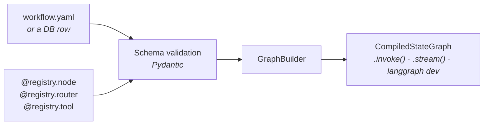

<div align="center">


**Topology in YAML. Logic in Python. One line to compile.**

[](https://github.com/pjasielski/langgraph-declarative/actions/workflows/ci.yml)
[](https://www.python.org/downloads/)
[](https://github.com/pjasielski/langgraph-declarative/blob/main/LICENSE)

<!-- Uncomment after the first PyPI release:
[](https://pypi.org/project/langgraph-declarative/)
[](https://pypistats.org/packages/langgraph-declarative)
-->


[Quickstart](#quickstart) · [Features](#features) · [YAML reference](#yaml-reference) · [Examples](https://github.com/pjasielski/langgraph-declarative/blob/main/examples/README.md) · [Roadmap](https://github.com/pjasielski/langgraph-declarative/blob/main/ROADMAP.md)

</div>

---

Describe a [LangGraph](https://github.com/langchain-ai/langgraph) workflow's **structure in YAML**, keep the **behaviour in Python**, and compile the two into a standard `CompiledStateGraph`. Nothing about how you run, stream, or deploy the graph changes.

> [!TIP]
> **Topology changes become config edits, not code rewrites.** Workflow structure can be diffed in review, validated in your IDE, rendered as a diagram, stored and versioned in a database, and read by people who don't write Python.

## Install

```bash
pip install langgraph-declarative                 # uv add langgraph-declarative
pip install "langgraph-declarative[anthropic]"    # optional: llm: support ([openai] too)
```

## Quickstart

**1. Register your functions.**

```python
from langgraph_declarative import Registry, build_graph

registry = Registry()

@registry.node("greet")
def greet(state):
    return {"messages": [{"role": "assistant", "content": "Hello! How can I help?"}]}

@registry.node("respond")
def respond(state):
    return {"messages": [{"role": "assistant", "content": "Goodbye!"}]}
```

**2. Declare the graph.**

```yaml
# workflow.yaml
nodes:
  - name: "greeter"
    function: "greet"
  - name: "responder"
    function: "respond"

edges:
  - source: "START"
    target: "greeter"
  - source: "greeter"
    target: "responder"
  - source: "responder"
    target: "END"
```

**3. Build and run.**

```python
graph = build_graph("workflow.yaml", registry)
result = graph.invoke({"messages": [{"role": "user", "content": "Hi there"}]})
```

That's the whole surface area. `build_graph()` validates the YAML with Pydantic, cross-checks every `function:` and `path:` against the registry, and hands you a compiled LangGraph.

> [!TIP]
> Every feature below has a commented, runnable example — see **[examples/](https://github.com/pjasielski/langgraph-declarative/blob/main/examples/README.md)**.

## How it fits together



Three pieces: a **registry** of Python functions, a **definition** of the topology, and a **builder** that joins them. Validation happens before compilation, so a typo in the YAML gives you `Unknown node function 'classfy'. Did you mean 'classify'?` — not a stack trace at runtime.

## Features

| Feature | YAML | Since | Example |
|---|---|---|---|
| Simple & parallel edges | `target: "node"` / `target: [a, b]` | v1 | [quickstart](https://github.com/pjasielski/langgraph-declarative/tree/main/examples/quickstart/), [fan_out](https://github.com/pjasielski/langgraph-declarative/tree/main/examples/fan_out/) |
| Conditional routing | `path:` + `targets:` | v1 | [conditional_routing](https://github.com/pjasielski/langgraph-declarative/tree/main/examples/conditional_routing/) |
| Dynamic fan-out (`Send`) | `path:` without `targets` | v1 | [dynamic_routing](https://github.com/pjasielski/langgraph-declarative/tree/main/examples/dynamic_routing/) |
| Custom Python state class | `build_graph(..., state_class=...)` | v1 | [custom_state](https://github.com/pjasielski/langgraph-declarative/tree/main/examples/custom_state/) |
| State declared in YAML | `state:` with types & reducers | v1.1 | [declared_state](https://github.com/pjasielski/langgraph-declarative/tree/main/examples/declared_state/) |
| Match routing (no router fn) | `match:` + `targets:` | v1.1 | [match_routing](https://github.com/pjasielski/langgraph-declarative/tree/main/examples/match_routing/) |
| Mermaid diagrams | `draw_mermaid()` | v1.1 | [visualization](https://github.com/pjasielski/langgraph-declarative/tree/main/examples/visualization/) |
| IDE autocomplete & validation | [`workflow.schema.json`](https://github.com/pjasielski/langgraph-declarative/blob/main/schema/workflow.schema.json) | v1.1 | [visualization](https://github.com/pjasielski/langgraph-declarative/tree/main/examples/visualization/) |
| Subgraph composition | `subgraph: "child.yaml"` | v2 | [subgraph](https://github.com/pjasielski/langgraph-declarative/tree/main/examples/subgraph/) |
| Cross-file node imports | `imports:` | v2 | [cross_file_imports](https://github.com/pjasielski/langgraph-declarative/tree/main/examples/cross_file_imports/) |
| LLM config & tool binding | `llm:` + `tools:` | v2 | [llm_and_tools](https://github.com/pjasielski/langgraph-declarative/tree/main/examples/llm_and_tools/) |
| Database-stored workflows | `SQLiteLoader`, `build_graph_from_db()` | v2 | [db_workflow](https://github.com/pjasielski/langgraph-declarative/tree/main/examples/db_workflow/) |
| LangGraph project template | — | v2 | [template/](https://github.com/pjasielski/langgraph-declarative/tree/main/template/) |

> [!NOTE]
> v1 / v1.1 / v2 are milestone labels, not package versions. All three have shipped — see [CHANGELOG.md](https://github.com/pjasielski/langgraph-declarative/blob/main/CHANGELOG.md) for releases.

## YAML reference

Only `nodes` is required. The simplest workflow is a list of nodes and edges.

<details>
<summary><b>Full schema — state, llm, imports, nodes, edges</b></summary>

```yaml
state:                              # declare the state schema (default: MessagesState)
  - name: "category"
    type: "str"                     # str | int | float | bool | list | dict | list[str] | list[dict]
  - name: "notes"
    type: "list[str]"
    reducer: "append"               # append | add_messages | replace (default)

llm:                                # graph-level LLM default for opt-in nodes
  provider: "anthropic"             # anthropic | openai
  model: "claude-opus-4-8"

imports:                            # merge node declarations from other files
  - file: "shared_nodes.yaml"
    nodes: ["error_handler"]        # omit to import all nodes

nodes:
  - name: "classifier"
    function: "classify"            # registered via @registry.node()
  - name: "research"
    subgraph: "child.yaml"          # embed another workflow (function XOR subgraph)
  - name: "agent"
    function: "agent_fn"            # function must accept an `llm` parameter to opt in
    llm: { model: "claude-haiku-4-5" }  # node-level override, merged over graph llm
    tools: ["get_weather"]          # @registry.tool() names or "module.path:attr"

edges:
  - source: "START"                 # START, END, or a node name
    target: "classifier"            # simple edge
  - source: "loader"
    target: ["a", "b"]              # parallel fan-out
  - source: "classifier"
    path: "router_name"             # @registry.router(); omit targets for Send routing
    targets: { key: "node" }
  - source: "classifier"
    match: "category"               # route on a state field's value — no Python router
    targets:
      billing: "billing_agent"
      default: "fallback"           # reserved fallback key
```

</details>

> [!TIP]
> Add this as the first line of any workflow file for autocomplete and inline validation in VS Code, JetBrains, and Neovim:
> ```yaml
> # yaml-language-server: $schema=path/to/workflow.schema.json
> ```
> The schema ships at [`schema/workflow.schema.json`](https://github.com/pjasielski/langgraph-declarative/blob/main/schema/workflow.schema.json), or regenerate it with `export_json_schema()`.

## API

| Function / Class | Description |
|---|---|
| `Registry()` | Holds node, router, and tool functions in separate namespaces |
| `@registry.node("name")` | Register a node function (transforms state) |
| `@registry.router("name")` | Register a router (returns a routing key or a list of `Send`) |
| `@registry.tool("name")` | Register a tool for `tools:` binding |
| `build_graph(path, registry, state_class=None)` | YAML file → compiled `CompiledStateGraph` |
| `build_graph_from_db(source, registry, db_path)` | DB-stored definition → compiled graph (`"flow"` or `"flow@2"`) |
| `draw_mermaid(path, registry, output_path=None)` | Compile and render a Mermaid diagram (`.md` → fenced block) |
| `export_json_schema(output_path=None)` | Emit the JSON Schema for workflow YAML files |
| `GraphBuilder(registry, state_class=None)` | Power-user class behind `build_graph()` |
| `SQLiteLoader(db_path)` | Save/load versioned definitions; implements the pluggable `Loader` protocol |

## Documentation

| Document | Contents |
|---|---|
| [examples/](https://github.com/pjasielski/langgraph-declarative/blob/main/examples/README.md) | 12 runnable examples, one per feature, organized by milestone |
| [template/](https://github.com/pjasielski/langgraph-declarative/tree/main/template/) | Starter project for `langgraph dev` using the declarative pattern |
| [ROADMAP.md](https://github.com/pjasielski/langgraph-declarative/blob/main/ROADMAP.md) | What shipped per milestone, and unvalidated future ideas |
| [CHANGELOG.md](https://github.com/pjasielski/langgraph-declarative/blob/main/CHANGELOG.md) | Release history |
| [DECISIONS.md](https://github.com/pjasielski/langgraph-declarative/blob/main/DECISIONS.md) | Why the API and the scope look the way they do |
| [docs/02-requirements/REQUIREMENTS.md](https://github.com/pjasielski/langgraph-declarative/blob/main/docs/02-requirements/REQUIREMENTS.md) | Problem, users, success criteria |
| [docs/03-design/DESIGN.md](https://github.com/pjasielski/langgraph-declarative/blob/main/docs/03-design/DESIGN.md) | Architecture, module responsibilities, trade-offs |

<details>
<summary><b>Project layout</b></summary>

```
src/langgraph_declarative/   # library (registry, schema, builder, state/llm factories, loaders)
schema/                      # generated JSON Schema for workflow YAML
examples/                    # runnable examples — one folder per feature
template/                    # LangGraph starter template
tests/                       # pytest suite + YAML fixtures
docs/                        # requirements, design, roadmap, reviews
```

</details>

## Requirements

- Python 3.10+
- LangGraph ≥ 0.2 · PyYAML ≥ 6.0 · Pydantic ≥ 2.0
- Optional: `[anthropic]` / `[openai]` extras for `llm:` support

## Contributing

Issues and pull requests welcome. Run the suite with `uv run pytest` before opening a PR.

## License

[MIT](https://github.com/pjasielski/langgraph-declarative/blob/main/LICENSE). Community project — not affiliated with or endorsed by LangChain. Built on top of [LangGraph](https://github.com/langchain-ai/langgraph).
